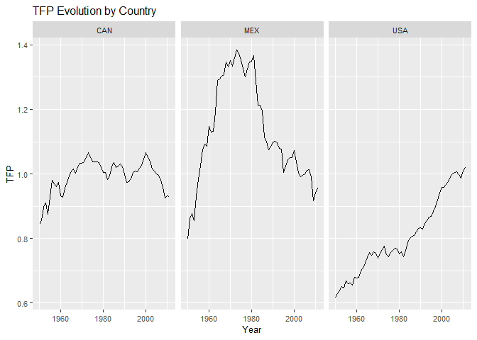
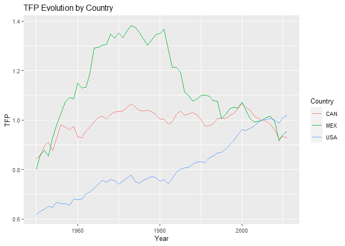
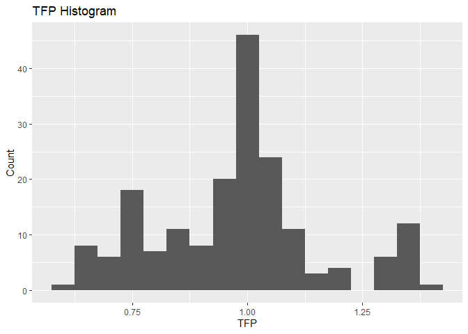
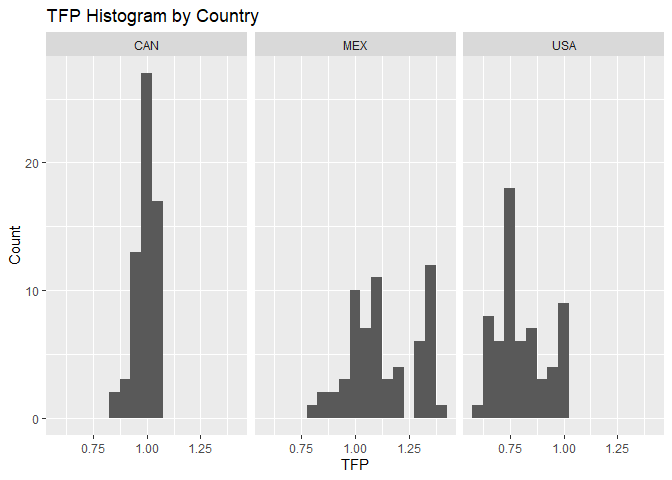
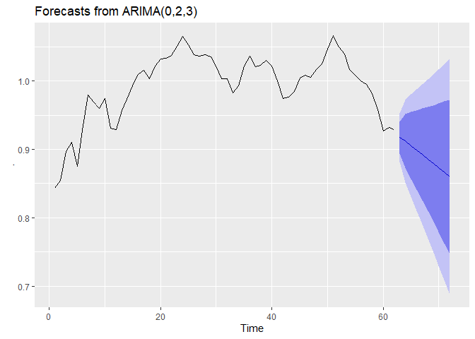
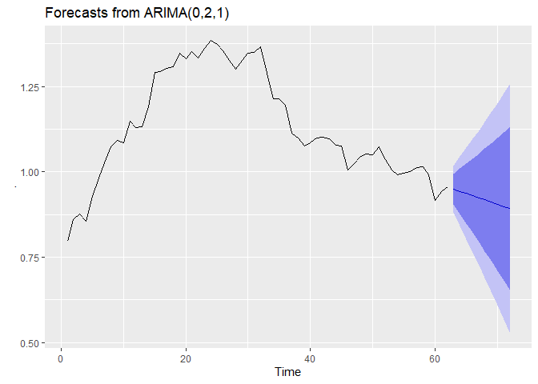
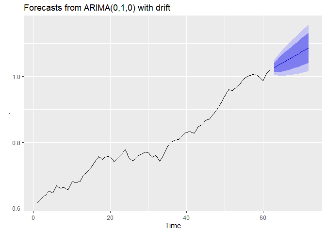
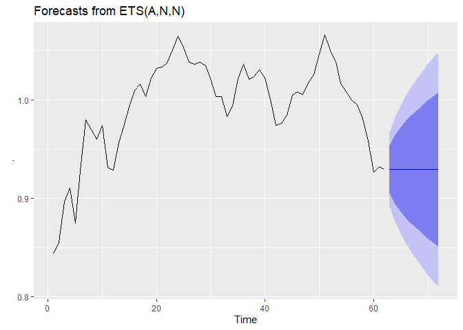
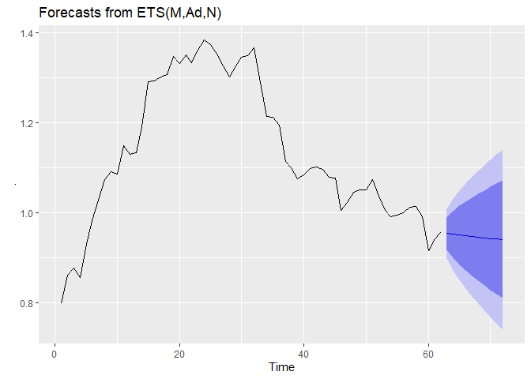
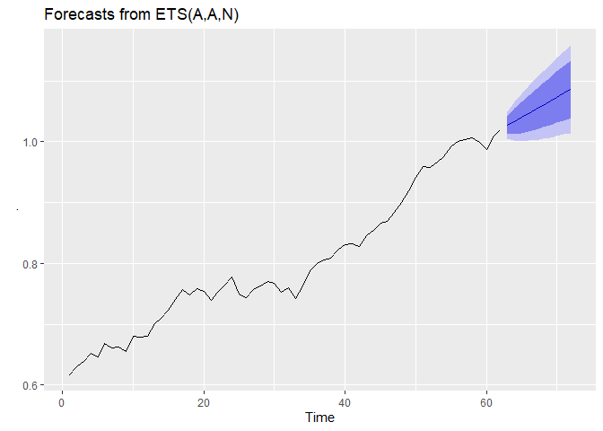

Challenge1\_4i
================

## R Markdown

This is an R Markdown document. Markdown is a simple formatting syntax for authoring HTML, PDF, and MS Word documents. For more details on using R Markdown see <http://rmarkdown.rstudio.com>.

When you click the **Knit** button a document will be generated that includes both content as well as the output of any embedded R code chunks within the document. You can embed an R code chunk like this:

## Challenge 1

We begin by selecting the diretory and then we open the data file.

``` r
setwd("C:/Users/Caique/Desktop/Mestrado_FEARP/Processo_seletivo/4intelligence")
tfpdata = read.csv("C:/Users/Caique/Desktop/Mestrado_FEARP/Processo_seletivo/4intelligence/Challenge_4i/TFP.csv")
```

Two important R packages for our analysis are "tydeverse" and "lubridate"

``` r
library(tidyverse)
```

    ## -- Attaching packages ---------------------------------------------------- tidyverse 1.3.0 --

    ## v ggplot2 3.3.0     v purrr   0.3.3
    ## v tibble  2.1.3     v dplyr   0.8.5
    ## v tidyr   1.0.2     v stringr 1.4.0
    ## v readr   1.3.1     v forcats 0.4.0

    ## -- Conflicts ------------------------------------------------------- tidyverse_conflicts() --
    ## x dplyr::filter() masks stats::filter()
    ## x dplyr::lag()    masks stats::lag()

``` r
library(lubridate)
```

    ## 
    ## Attaching package: 'lubridate'

    ## The following object is masked from 'package:base':
    ## 
    ##     date

## 1 - Exploratory data analysis

The exploratory data analysis begin with the transformation of the variable "year" to a date form.

``` r
tfpdata$year = as.Date(ISOdate(as.character(tfpdata$year),1,1))
```

The first plot shows the evolution of the total factor productivity (TFP) through the years, as we make separate graphs for the three different countries (Canada, Mexico, and United States).

Note that the Canada TFP evolution is the most stable. For Mexico, there is a strong variation, as the TFP increases from 1950 until 1981 and then decreases very significantly until 2011, with small periods of growth. The USA TFP has a strong positive trend, as it increases from 1950 until 2011 with slight periods of stagnation.

``` r
ggplot(tfpdata,aes(x=year(year),y=rtfpna,group=1)) +
  ggtitle("TFP Evolution by Country") +
  facet_wrap(~isocode) +
  theme(text = element_text(size=10)) +
  labs(x = "Year", y = "TFP") +
  geom_line()
```



The second plot is basically the previous one, but in only one graph.

``` r
ggplot(tfpdata,aes(x=year(year), y=rtfpna, colour = isocode)) +
  ggtitle("TFP Evolution by Country") +
  theme(text = element_text(size=10)) +
  labs(x = "Year", y = "TFP", colour = "Country") +
  geom_line()
```



To help us with the statistics description, as well as the forecasts we are going to make further into this challenge, we make three different databases, separating by country.

``` r
candata = filter(tfpdata,isocode=="CAN")
usadata = filter(tfpdata,isocode=="USA")
mexdata = filter(tfpdata,isocode=="MEX")
```

Now we present the statistics description (adding standard deviations) for the whole data set, and then we show the same statistics separated by country. The statistics confirm the graphic analysis, as Mexico's stantard deviation is the greater one, followed by USA's. Mexico also presents the larger TFP mean, median, and maximum value.

``` r
# The whole data
summary(tfpdata$rtfpna)
```

    ##    Min. 1st Qu.  Median    Mean 3rd Qu.    Max. 
    ##  0.6171  0.8551  0.9950  0.9756  1.0463  1.3837

``` r
sd(tfpdata$rtfpna)
```

    ## [1] 0.1775383

``` r
# Canada
summary(candata$rtfpna)
```

    ##    Min. 1st Qu.  Median    Mean 3rd Qu.    Max. 
    ##  0.8433  0.9733  1.0042  0.9929  1.0295  1.0661

``` r
sd(candata$rtfpna)
```

    ## [1] 0.05012575

``` r
# United States
summary(usadata$rtfpna)
```

    ##    Min. 1st Qu.  Median    Mean 3rd Qu.    Max. 
    ##  0.6171  0.7399  0.7660  0.8038  0.8805  1.0204

``` r
sd(usadata$rtfpna)
```

    ## [1] 0.1161212

``` r
# Mexico
summary(mexdata$rtfpna)
```

    ##    Min. 1st Qu.  Median    Mean 3rd Qu.    Max. 
    ##  0.7982  1.0122  1.0939  1.1301  1.2996  1.3837

``` r
sd(mexdata$rtfpna)
```

    ## [1] 0.158209

Finally, we present histograms. The first one considers the whole TFP data and then we have three different TFP histograms, separated by country. In the first histogram, the majority of the values concentrate around the mean (0.995).

``` r
ggplot(tfpdata) +
  geom_histogram(mapping = aes(x = rtfpna), binwidth = 0.05) +
  labs(x = "TFP", y = "Count") + 
  ggtitle("TFP Histogram")
```



When observing the countries separately, the greater variation of Mexico and USA is clear, compared to Canada.

``` r
ggplot(tfpdata) +
  geom_histogram(mapping = aes(x = rtfpna), binwidth = 0.05) +
  labs(x = "TFP", y = "Count") + 
  facet_wrap(~isocode) +
  ggtitle("TFP Histogram by Country")
```



### 2 - Forecasting

We begin the forecasting section by installing the "forecast" package.

``` r
library(forecast)
```

We choose two forecasting procedures, ARIMA and ETS, considering the three countries separately. Both ARIMA and ETS model the time series automatically, as we are not analysing the data deeply enough to sort out what the best models to use. First, the ARIMA forecasts.

Note that the ARIMA approach forecasts a decreasing TFP for the ten years after 2011.

``` r
# Canada forecast - ARIMA
candata$rtfpna %>%
  auto.arima() %>%
  forecast(h=10) %>%
  autoplot()
```



The ARIMA forecasts a decreasing TFP for Mexico, as well.

``` r
# Mexico forecast - ARIMA
mexdata$rtfpna %>%
  auto.arima() %>%
  forecast(h=10) %>%
  autoplot()
```



Considering the USA, the ARIMA forecasts a TFP increase for the next ten years.

``` r
# USA forecast - ARIMA
usadata$rtfpna %>%
  auto.arima() %>%
  forecast(h=10) %>%
  autoplot()
```



Now it's time to present the ETS forecasts. Considering Canada, it forecasts constant TFP values for the next ten years.

``` r
# Canada forecast - ETS
candata$rtfpna %>%
  ets() %>%
  forecast(h=10) %>%
  autoplot()
```



Similar to the ARIMAm, the ETS forecasts slighly decreasing TFP values for Mexico.

``` r
# Mexico forecast - ETS
mexdata$rtfpna %>%
  ets() %>%
  forecast(h=10) %>%
  autoplot()
```



For the USA, the ETS forecasts increasing TFP values, just like the ARIMA, as well.

``` r
# USA forecast - ETS
usadata$rtfpna %>%
  ets() %>%
  forecast(h=10) %>%
  autoplot()
```



## 3 - Explaining the TFP

In the previous exercises, we only used TFP past values to construct its forecasts. Now we can pick other variables that could help us explaining the TFP behavior. Productivity is very related to GDP or GDP per capita, so that we might expect that the same factors influencing the GDP per capita will influence the TFP. The most "classic" variables that affects GDP per capita (and, therefore, productivity) are education, openess, institutions, investment (which is related to capital stock), and many others. Therefore, we will try to find these type of variables to explain the TFP. Observing the original list of variables, we choose the following.

hc - Index of human capital per person, based on years of schooling (Barro and Lee 2013) and returns to education (Psacharopoulos 1994).

rkna - Capital stock at constant 2005 national prices (in million 2005 USD).

csh\_x - Share of merchandise exports at current PPPs.

csh\_m - Share of merchandise imports at current PPPs.

The sum of the magnitude of the last two variables can be an openess indicator. So, these are the four variables we think that could be helpful in explaining the TFP.
